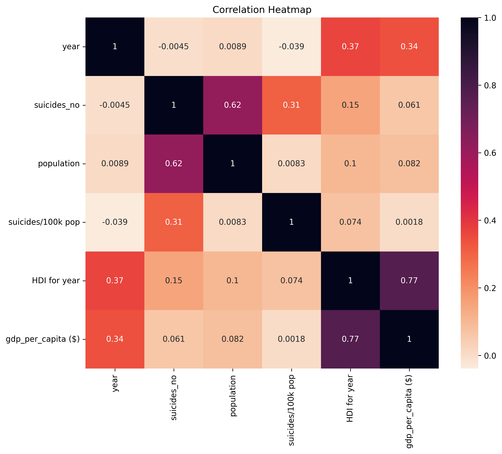
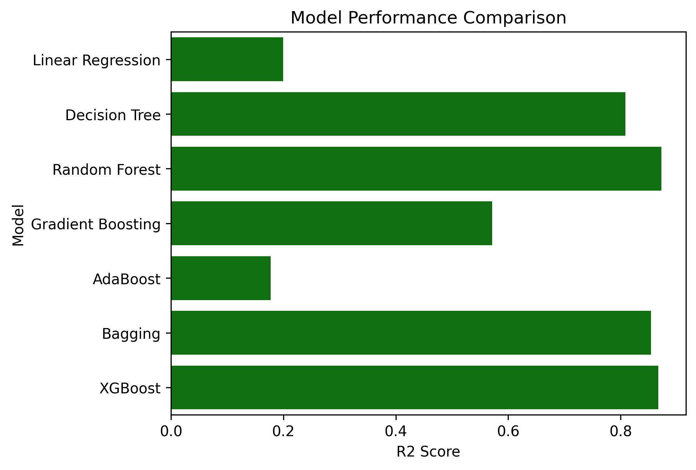
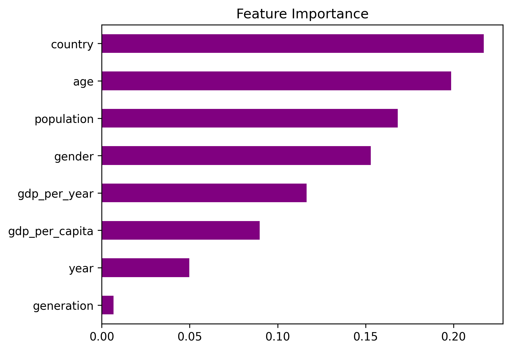
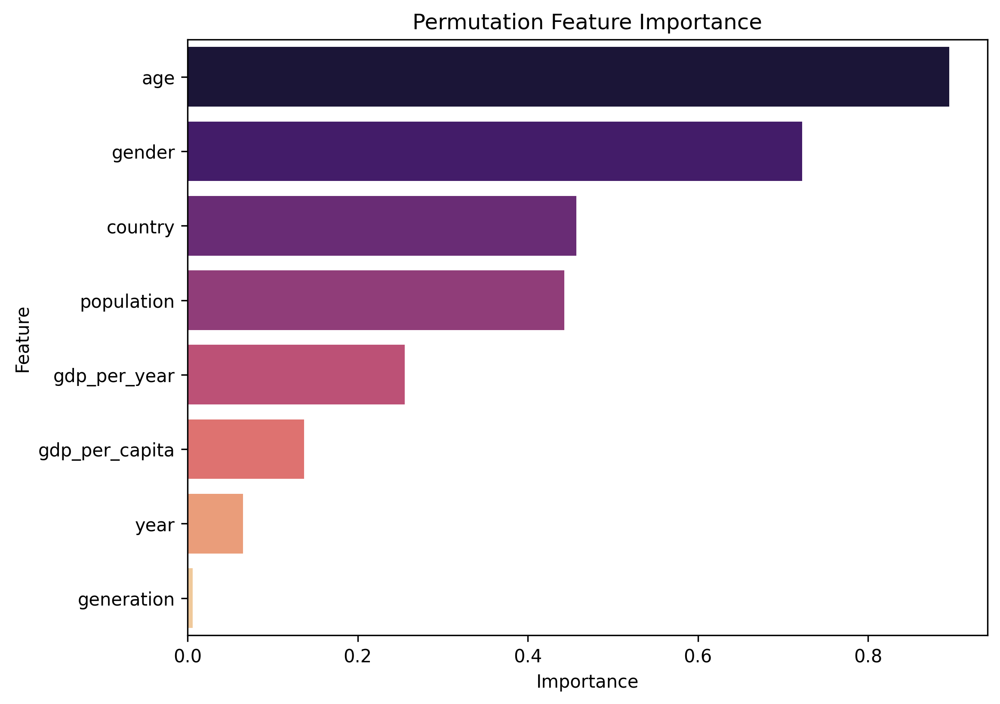

# Suicide Rate Analysis and Prediction Using Machine Learning

## Project Overview

This project analyzes global suicide trends using demographic and socioeconomic data and develops machine learning models to predict suicide rates. The workflow includes data cleaning, exploratory data analysis (EDA), feature engineering, data preprocessing, model training, model evaluation, and feature importance analysis.

The project aims to uncover the key factors associated with suicide rates while comparing the performance of multiple regression models.

---

## Objectives

- Analyze global suicide trends using demographic and economic variables.
- Clean and preprocess the dataset for machine learning.
- Explore patterns through data visualization and statistical analysis.
- Build and evaluate multiple machine learning regression models.
- Compare model performance using evaluation metrics.
- Identify the most influential features affecting suicide rates.

---

## Dataset

- **Dataset:** Suicide Rates Overview (1985–2016)
- **Source:** Kaggle
- **Format:** CSV
- **Records:** ~27,820 observations
- **Features:** Country, Year, Gender, Age Group, Population, GDP, Generation, Suicide Rate, and more.

---

## Technologies Used

| Category | Tools |
|----------|-------|
| Programming | Python |
| Data Analysis | Pandas, NumPy |
| Visualization | Matplotlib, Seaborn |
| Machine Learning | Scikit-learn, XGBoost |
| Development Environment | Google Colab |

---

## Project Workflow

- Data Loading
- Dataset Exploration
- Missing Value Analysis
- Correlation Analysis
- Data Cleaning
- Exploratory Data Analysis (EDA)
- Feature Engineering
- Encoding Categorical Variables
- Feature Scaling
- Train-Test Split
- Model Training
- Model Evaluation
- Model Comparison
- Feature Importance Analysis

---

## Machine Learning Models

The following regression models were trained and evaluated:

- Linear Regression
- Decision Tree Regressor
- Random Forest Regressor
- AdaBoost Regressor
- Bagging Regressor
- XGBoost Regressor

Models were evaluated using **R² Score** and **Root Mean Squared Error (RMSE)** to compare predictive performance.
  
---

## Model Performance

Ensemble learning models outperformed simpler regression algorithms.

| Model | Performance |
|-------|-------------|
| Random Forest | ⭐ Excellent |
| XGBoost | ⭐ Excellent |
| Bagging | ⭐ Excellent |
| Decision Tree | Good |
| Linear Regression | Moderate |
| AdaBoost | Lower Performance |

---

## Key Insights

- Suicide rates vary significantly across age groups and gender.
- Economic indicators show measurable relationships with suicide rates.
- Ensemble models achieved superior predictive performance.
- Feature importance analysis identified demographic and economic variables as major predictors.

---

## Skills Demonstrated

- Data Cleaning
- Exploratory Data Analysis (EDA)
- Feature Engineering
- Feature Scaling
- Machine Learning
- Regression Modeling
- Model Evaluation
- Feature Importance Analysis
- Data Visualization

---

## Repository Structure

```text
Suicide-Rate-Prediction/
│
├── suicide_rate_prediction.ipynb
├── README.md
├── requirements.txt
├── LICENSE
├── data/
│   └── master.csv
└── images/
```

---

## Visualizations

### Correlation Heatmap



### Model Comparison



### Feature Importance



### Permutation Feature Importance



---

## Future Improvements

- Perform hyperparameter tuning to improve model performance.
- Evaluate additional regression algorithms.
- Explore advanced feature engineering techniques.
- Build an interactive dashboard to visualize predictions.
- Deploy the model as a Streamlit application.

---

## How to Run

1. Clone this repository.

```bash
git clone <repository-url>
```

2. Install the required libraries.

```bash
pip install -r requirements.txt
```

3. Ensure the dataset is located inside the `data` folder.

4. Open `suicide_rate_prediction.ipynb` in Jupyter Notebook, VS Code, or Google Colab.

5. Run all cells.

---

## Author

**Chinnu Thomas**

Aspiring Data Analyst | Python | SQL | Excel | Power BI

---
